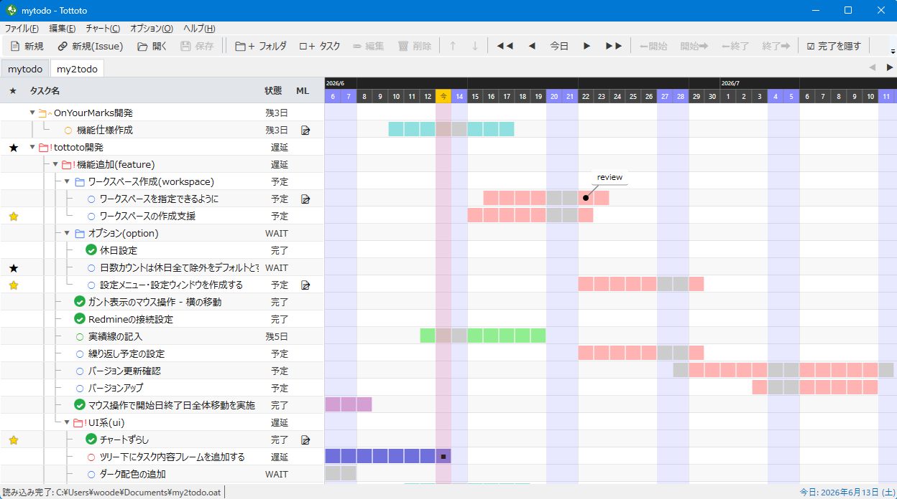

# Tottoto

**タスク管理 & ガントチャート Windowsデスクトップアプリ**

タスクをツリー構造で管理しながら、ガントチャートで進捗を視覚的に把握できる軽量なデスクトップアプリです。

---

## 主な機能

### タスクツリー & ガントチャート

- フォルダとタスクを階層構造で管理できます。
- ガントチャートで各タスクの期間・進捗を一目で確認できます。
- タスクはドラッグ＆ドロップで並べ替え・移動が可能です。
- 子タスクの状態を集約し、フォルダ単位のステータス（進行中 / 遅延 / 完了 など）を自動計算します。

### 今日のスケジュール表示

- 本日が期間内に含まれるタスクを一覧表示するビューを備えています。

### 吹き出し注釈（コールアウト）

- ガントチャート上の任意の位置に吹き出し形式のメモを付与できます。
- 表示スタイルや表示条件をタスクごとに設定できます。

### Issue トラッキング連携

外部の Issue 管理サービスとタスクを紐付けられます。

| 対応サービス |
|---|
| GitLab Issues |
| Jira Cloud |
| Jira オンプレミス |
| Redmine |

### 休日設定

- 日本の祝日を自動取得し、ガントチャートに反映できます。
- 任意の休日（会社独自の休業日など）を追加することも可能です。

### アーカイブ

- 完了済みタスクをアーカイブとして保存し、一覧から参照できます。

---

## 動作環境

- Windows 10 / 11
- .NET 8 ランタイム

---

## インストール

[Releases](../../releases) から最新版の `tottoto-<version>-win-x64.zip` をダウンロードし、ZIP を展開して `Tottoto.exe` を起動してください。

---

## ライセンス

MIT License — 詳細は [LICENSE](LICENSE) を参照してください。
